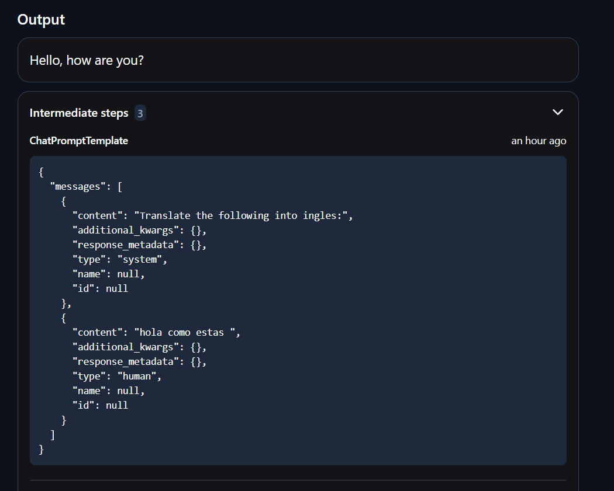
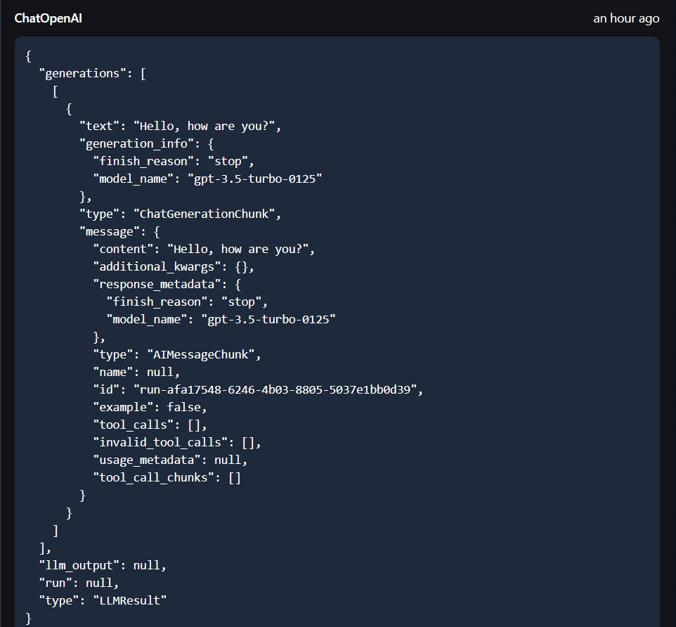
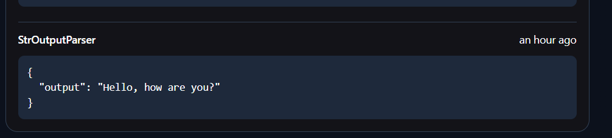
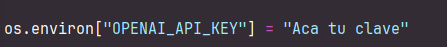
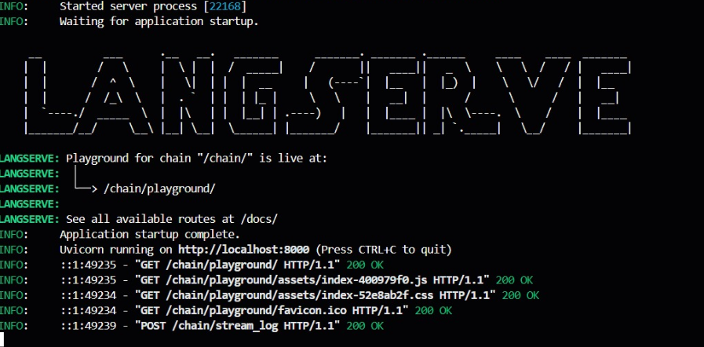
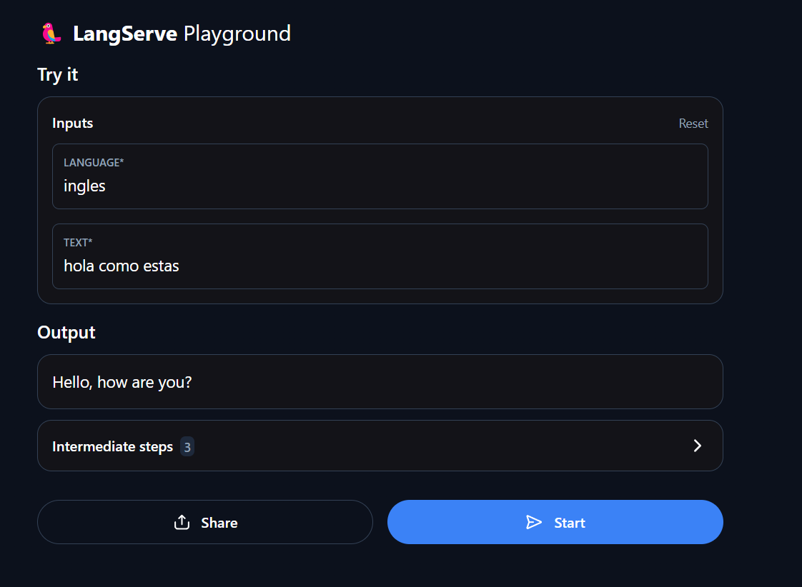

# LangChatGPT: Implementación del Tutorial LLM Chain con LangChain

Este proyecto implementa una API de traducción automática utilizando FastAPI y LangChain,  herramientas  que facilitan la integración de modelos de lenguaje en aplicaciones web.

Esta aplicación permitirá traducir texto de un idioma a otro utilizando GPT-4 para generar las traducciones,A través de LangChain, se encadenan varios componentes (plantillas de mensajes, invocación del modelo y procesamiento de resultados)

Este proyecto implementa el tutorial [LLM Chain](https://python.langchain.com/docs/tutorials/llm_chain/),

## ⚙️ Arquitectura 
### 1. **Entrada del Usuario(cliente)**
El cliente envía una solicitud HTTP a la API con los siguientes parámetros:
- **`language`**: El idioma al que se desea traducir el texto (por ejemplo, "italian").
- **`text`**: El texto que se va a traducir.

### 2. **API RESTful (FastAPI)**
El servidor web implementado con **FastAPI** gestiona las solicitudes HTTP, recibiendo el texto y el idioma de destino y pasando la solicitud a la cadena de procesamiento de **LangChain**.

### 3. **LangChain - Cadena de Procesamiento**
LangChain organiza el flujo de trabajo para traducir el texto:
- **Prompt Template**: Define cómo estructurar los mensajes enviados al modelo de lenguaje.
  -  
- **ChatOpenAI (GPT-4)**: Modelo de lenguaje que genera la traducción.
  -  
- **StrOutputParser**: Extrae la traducción del modelo, Una vez que el modelo genera la traducción lo devuelve como la respuesta de la API
  -  

### 4. **LangServe (servidor)**
El servidor recibe una solicitud en la ruta /chain con los parámetros language (idioma al que se traduce) y text (texto a traducir) y utiliza la API.
 Usa **LangServe** para desplegar la aplicación como una API RESTful, facilitando la interacción con la API desde otros servicios o clientes.

## 🚀Empezando

### Requisitos Previos

Para ejecutar este proyecto, necesitarás tener instalado:

- Python.
- Un IDE de Python de su preferencia.
- Un navegador web para interactuar con el servidor y la API.

### Instalación

1. Tener instalado Git en tu máquina local.
2. Elegir una carpeta en donde guardar el proyecto.
3. Abrir la terminal de GIT (ccho y seleccionar "Git bash here").
4. Clonar el repositorio en tu máquina local:lic dere
   ```bash
   https://github.com/juliandtrianar/Taller-de-LLM-pre-lab.git
5. Instalar un ambiente virtual de python, para que jupyter notebook pueda correr todas las dependencias

6. Proporcione la API Key en las variables que se encuentran vacias sobre los archivos langchainbasicaapp.ipynb y langchainserver.py:

   


### Deployment

1. Abre el proyecto con tu IDE favorito o navega hasta el directorio del proyecto.
2. Ejecute todos los comandos del archivo jupyter Notebook 

4. Desde la terminal, ejecuta los dos archivos de python
     ```bash
   python langchainserver.py
   python langchainclient.py
5. El servidor iniciará
   

6. Finalmente, puedes interactuar con la aplicación ingresando a:  
 - http:localhost:8000/chain/playground 
   

   
### Built with
- [Python](https://www.python.org)
- [Jupyter](https://jupyter.org/)

## Authors

* **Julián David Triana Roa** -  [juliandtrianar](https://github.com/juliandtrianar)

